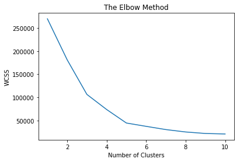
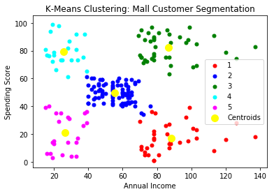

# Machine Learning: Clustering Models on Python

## Summary

In previous examples we looked at supervised machine learning models working with labeled sets of data. Here we will explore an example of unsupervised machine learning working with unlabeled sets of data to find clusters or groupings within the data.

## K-Means Clustering

K-Means Clustering is an algorithm designed to find clustering in an unlabeled dataset. The K-Means Clustering algorithm follows these steps to achieve this,

  1. Choose the number K of clusters. The number of clusters we choose will be dependent on the business problem at hand. When in doubt, one could perform the Elbow Method to find the theoretical optimum number of clusters by using the Within Cluster Sum of Squares (WCSS) as a cost function metric.
  2. Select at random, K points or the centroids of clusters. Since the K points initialization is chosen at random, it may affect the algorithms performance if the points are chosen poorly. Python implements the K-Means++ algorithm which accounts for the random initialization trap behind the scenes.
  3. Assign each data point to the closest centroid to form clusters. For example using Euclidean distances to find the closest data point to each centroid
  4. Find the center point of each cluster and move the K centroid points to the cluster center
  5. Reassign each data point to the closest centroid to form new clusters
  6. Iterate this process until the optimum K centroid points are found

Using K-Means Clustering we will explore a customer segmentation example. The [Mall Customer dataset](./dataset/Mall_Customers.csv) contains information of customers who subscribe to a mall membership card. The dataset contains customer information by gender, age, annual income, and spending score based on amount spent. We will segment the customers by annual income and spending score using K-Means Clustering.

First we load all our libraries and load the dataset.

```Python
# Import Libraries
import numpy as np
import pandas as pd
import matplotlib.pyplot as plt

# Load Dataset
dataset = pd.read_csv('./dataset/Mall_Customers.csv')
X = dataset.iloc[:,[3,4]].values
```

Next we must perform the elbow method to find the optimum number of clusters for our algorithm. To perform the elbow method we need to follow 2 steps.

First we must fit a K-Means Clustering model using the KMeans class from the scikit-learn cluster library. The KMeans class requires 4 key arguments:
  1. n_clusters: number of clusters of the K-Means algorithm
  2. init: an algorithm that optimizes the random initialization of the centroids
  3. max_iter: number of iterations of the K-Means algorithm, or the number of times the centroids are reassigned
  4. n_init: number of times the K-Means algorithm will be run, using different initial centroids each time

And second, using the inertia_ method from the KMeans class, we compute the sum of squared error as a cost function. Intuitively the more clusters we introduce, the smaller the error. As the number of clusters approaches infinity, the error converges to zero. What we are looking for in the Elbow Method is the point of convergence, where the error starts to plateau.

By iterating these 2 steps we can perform the Elbow Method to find the optimum number of clusters of our dataset as seen in the figure below.

```Python
# Using the elbow method to find the optimium number of clusters
from sklearn.cluster import KMeans
wcss = []
for i in range(1,11):
    kmeans = KMeans(n_clusters = i, init = 'k-means++', max_iter = 300, n_init = 10, random_state = 0)
    kmeans.fit(X)
    wcss.append(kmeans.inertia_)
plt.plot(range(1,11), wcss)
plt.title('The Elbow Method')
plt.xlabel('Number of Clusters')
plt.ylabel('WCSS')
```



From the Elbow Method results, we can conclude that the optimum number of centroids is 5.

We can now apply K-Means Clustering and visualize our results.

```Python
# Applying K-Means Clustering
kmeans = KMeans(n_clusters = 5, init = 'k-means++', max_iter = 300, n_init = 10, random_state = 0)
y = kmeans.fit_predict(X)

# Visualizing the clusters and their respective centroids using Matplotlib
plt.scatter(X[y == 0, 0], X[y == 0, 1], s=25, c='red', label='1')
plt.scatter(X[y == 1, 0], X[y == 1, 1], s=25, c='blue', label='2')
plt.scatter(X[y == 2, 0], X[y == 2, 1], s=25, c='green', label='3')
plt.scatter(X[y == 3, 0], X[y == 3, 1], s=25, c='cyan', label='4')
plt.scatter(X[y == 4, 0], X[y == 4, 1], s=25, c='magenta', label='5')
plt.scatter(kmeans.cluster_centers_[:,0], kmeans.cluster_centers_[:,1], s = 100, c='yellow', label = 'Centroids')
plt.title('K-Means Clustering: Mall Customer Segmentation')
plt.xlabel('Annual Income')
plt.ylabel('Spending Score')
plt.legend()
```



We can visually see the different clustering of customers. For example we can group the clusters as follows:
  - Cluster 1: These are the high income/low spending customers. We would classify this cluster as the careful shopper
  - Cluster 2: These are the average income/average spending customers. We would classify this cluster as the standard shopper
  - Cluster 3: These are the high income/high spending customers. We would classify this cluster as the target shopper
  - Cluster 4: These are the low income/low spending customers. We would classify this cluster as the sensible shopper
  - Cluster 5: These are the low income/high spending customers. We would classify this cluster as the careless shopper

We can then start to perform different types of marketing strategies and offer promotions or advertisements based on the different customer groups.
