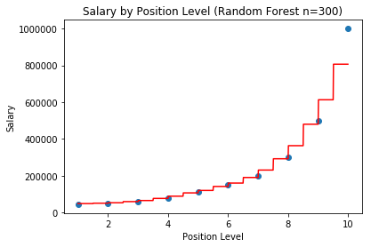

# Machine Learning: Regression Models on Python

## Summary

Regression models are used to predict real values, for example it can be used to forecast housing prices, salaries of employees, projected revenues and expenses of a business.
Depending on the business problem, the regression model can be either linear or non-linear. We will examine examples of both linear and non-linear cases, focusing on the following models:
  - Simple Linear Regression
  - Multivariate Linear Regression
  - Polynomial Regression
  - Decision Tree Regression
  - Random Forest Regression

## Simple Linear Regression

For this example, we look at the correlation between a person's years of experience and their salary using a linear regression model. This will help add business value for a company, for example when determining salaries of future employees.

First we need to load the [Salary Dataset](./dataset/Salary_Data.csv) into Python.
Using Pandas, we load the csv file and define our features and label.

```Python
import pandas as pd
dataset = pd.read_csv('./dataset/Salary_Data.csv')
# Features, Years of Experience
X = dataset.iloc[:,:-1].values
# Label, Salary
y = dataset.iloc[:,-1].values
```

Next we move onto the model selection and preprocessing of our data by splitting it into a training set and a test set.
The train_test_split method takes in 3 key arguments, which are the features, labels, and the size of the test set. The random_state argument allows us to get consistent results when the train_test_split method splits and randomizes the dataset into subsets.

```Python
from sklearn.model_selection import train_test_split
X_train, X_test, y_train, y_test = train_test_split(X, y, test_size=1/3, random_state = 0)
```

The linear regression model on scikit-learn does not need require features scaling, as it is already done behind the scenes. Once we have successfully split the dataset we can move onto fitting and training the model. From the linear_model library on scikit-learn we will use the LinearRegression class. The fit method optimizes our model and finds the parameters that 'best fits' our training data. Once we have trained our model, we can predict for new values using the test set to evaluate the performance of our model.

```Python
from sklearn.linear_model import LinearRegression()
regressor = LinearRegression()
# Fit Model using Training set
regressor.fit(X_train, y_train)
# Predict Using Test set
y_pred = regressor.predict(x_test)
```

Using matplotlib we can visualize the results.


## Multi-Linear Regression

For this example, we look at the [50 Startup Dataset](./dataset/50_Startup.csv) to examine the correlation between the R&D Expense, Administration Expense, and Marketing Expense to a company's profits.

The multi-linear regression utilizes the same library and class from scikit-learn as the example above, except in this case we deal with multiple features.

The dataset we are working with in this example contains a categorical column of data. This column consists of the State that the companies are operating in. We will need to encode the categorical data into numerical data so that they can be utilized by our model. To do this we will use the LabelEncoder and OneHotEncoder classes from the preprocessing library in scikit-learn.

```Python
from sklearn.preprocessing import LabelEncoder, OneHotEncoder
labelencoder_X = LabelEncoder()
X[:,3] = labelencoder_X.fit_transform(X[:,3])
onehotencoder = OneHotEncoder(categorical_features = [3])
X = onehotencoder.fit_transform(X).toarray()
```

When dealing with multiple set of features, it is important to optimize our model through feature selection. For example, we will optimize the models performance by using the Backward Elimination Method. In the Backward Elimination Method we will use the statistical parameters of the p-value and Adjusted R-squared to select the most significant set of features.

First we will need to use the statsmodels library for statistical analysis.
```Python
import statsmodels.formula.api as sm
```

Next we need to append a column of ones using NumPy to our features to take into account the constant or intercept value of our regression line. We then use the Ordinary Least Squares method from the statsmodels library to build our regression model with all of our features.

```Python
X = np.append(np.ones((len(X), 1)), X, axis = 1)
X_opt = X[:, [0,1,2,3,4,5]]
import statsmodels.formula.api as sm
regressor_OLS = sm.OLS(endog=y, exog = X_opt).fit()
```

Using the summary method, we can generate the following table below:

```Python
regressor_OLS.summary()
```

OLS Regression Results                            
==============================================================================
Dep. Variable:                      y   R-squared:                       0.951
Model:                            OLS   Adj. R-squared:                  0.945
Method:                 Least Squares   F-statistic:                     169.9
Date:                Fri, 28 Jun 2019   Prob (F-statistic):           1.34e-27
Time:                        15:00:06   Log-Likelihood:                -525.38
No. Observations:                  50   AIC:                             1063.
Df Residuals:                      44   BIC:                             1074.
Df Model:                           5                                         
Covariance Type:            nonrobust                                         
==============================================================================
                coef    std err          t      P>|t|      [0.025      0.975]
------------------------------------------------------------------------------
const       5.013e+04   6884.820      7.281      0.000    3.62e+04     6.4e+04
x1           198.7888   3371.007      0.059      0.953   -6595.030    6992.607
x2           -41.8870   3256.039     -0.013      0.990   -6604.003    6520.229
x3             0.8060      0.046     17.369      0.000       0.712       0.900
x4            -0.0270      0.052     -0.517      0.608      -0.132       0.078
x5             0.0270      0.017      1.574      0.123      -0.008       0.062
==============================================================================
Omnibus:                       14.782   Durbin-Watson:                   1.283
Prob(Omnibus):                  0.001   Jarque-Bera (JB):               21.266
Skew:                          -0.948   Prob(JB):                     2.41e-05
Kurtosis:                       5.572   Cond. No.                     1.45e+06
==============================================================================

Note the Adjusted R-Squared value and the column of p-values associated to each of the features from the table above.
To summarize, the Adjusted R-Squared value is a measure of how well our model fits our data. It optimizes the model by minimizing the sum of squared errors and finding the "best fit" to our model. The closer the R-Squared value is to 1, the more accurate our model, at least theoretically. There is still the case of overfitting that we will not get into.
The p-value testing is used to determine the statistical significance of the features used to build the model. As a rule of thumb we set a significance level of 0.05. If the p-value is greater than the significance level, the feature is not a significant one and we would remove it from our model.
Using the Adjusted R-Squared and the p-value testing in a Backward Elimination, we find the best set of features that optimizes our models performance.

For example, from the table above our model with a full set of features has an Adjusted R-Squared of 0.945 and the features have p-values of 0.953, 0.990, 0.000, 0.608, and 0.123, respectively. So using Backward Elimination we would remove the feature with the highest p-value or the least significant feature, x2. We would then refit our model and generate the new table below.

```Python
X = np.append(np.ones((len(X), 1)), X, axis = 1)
X_opt = X[:, [0,1,3,4,5]]
regressor_OLS = sm.OLS(endog=y, exog = X_opt).fit()
regressor_OLS.summary()
```

OLS Regression Results                            
==============================================================================
Dep. Variable:                      y   R-squared:                       0.951
Model:                            OLS   Adj. R-squared:                  0.946
Method:                 Least Squares   F-statistic:                     217.2
Date:                Tue, 02 Jul 2019   Prob (F-statistic):           8.49e-29
Time:                        21:24:34   Log-Likelihood:                -525.38
No. Observations:                  50   AIC:                             1061.
Df Residuals:                      45   BIC:                             1070.
Df Model:                           4                                         
Covariance Type:            nonrobust                                         
==============================================================================
coef    std err          t      P>|t|      [0.025      0.975]
------------------------------------------------------------------------------
const       5.011e+04   6647.870      7.537      0.000    3.67e+04    6.35e+04
x1           220.1585   2900.536      0.076      0.940   -5621.821    6062.138
x2             0.8060      0.046     17.606      0.000       0.714       0.898
x3            -0.0270      0.052     -0.523      0.604      -0.131       0.077
x4             0.0270      0.017      1.592      0.118      -0.007       0.061
==============================================================================
Omnibus:                       14.758   Durbin-Watson:                   1.282
Prob(Omnibus):                  0.001   Jarque-Bera (JB):               21.172
Skew:                          -0.948   Prob(JB):                     2.53e-05
Kurtosis:                       5.563   Cond. No.                     1.40e+06
==============================================================================

After a single iteration of the Backward Elimination method, we see an improved Adjusted R-Squared value. We would keep repeating the Backward Elimination process above until,
  1. The highest value of Adjusted R-Squared is reached
  2. The p-value of features are all within the significance level

## Polynomial Regression

Next we look at an example of a non-linear regression model, the polynomial regression.
We look at the [Position Salaries Dataset](./dataset/Position_Salaries.csv) to look at the correlation between the level of position and the salary amount.

For this example, we will not split our dataset into training and test sets due to the fact that we do not have a large enough sample size and to preserve the models accuracy. We will examine the different degrees of the polynomial feature to see which degree best fits our data.

First we get the linear regression model.

```Python
from sklearn.linear_model import LinearRegression
lin_reg = LinearRegression()
lin_reg.fit(X.reshape(-1,1), y)
```

Then we get our different sets of PolynomialFeatures by their respective degree of polynomial using scikit-learn.
```Python
from sklearn.preprocessing import PolynomialFeatures
poly_four = PolynomialFeatures(degree=4)
X_poly4 = poly_four.fit_transform(X.reshape(-1,1))
poly_three = PolynomialFeatures(degree=3)
X_poly3 = poly_three.fit_transform(X.reshape(-1,1))
poly_two = PolynomialFeatures(degree=2)
X_poly2 = poly_two.fit_transform(X.reshape(-1,1))
lin_reg2 = LinearRegression()
lin_reg2.fit(X_poly2, y)
lin_reg3 = LinearRegression()
lin_reg3.fit(X_poly3, y)
lin_reg4 = LinearRegression()
lin_reg4.fit(X_poly4, y)
```

After we have trained all 4 of our models, we can visualize the results to see how well each model fits our data.
```Python
X_grid = np.arange(min(X), max(X), 0.1)
X_grid = X_grid.reshape((len(X_grid),1))
plt.scatter(X, y, color='r')
plt.plot(X_grid, lin_reg.predict(X_grid), color='b', label='Degree: 1')
plt.plot(X_grid, lin_reg2.predict(poly_two.fit_transform(X_grid.reshape(-1,1))), label='Degree: 2')
plt.plot(X_grid, lin_reg3.predict(poly_three.fit_transform(X_grid.reshape(-1,1))), label='Degree: 3')
plt.plot(X_grid, lin_reg4.predict(poly_four.fit_transform(X_grid.reshape(-1,1))), label='Degree: 4')
plt.legend()
plt.xlabel('Position Level')
plt.ylabel('Salary')
plt.title('Salary by Position Level (Polynomial Regression)')
plt.show()
```


We can see that the fourth degree polynomial fits our data the best.
Using our models we can also predict for new salaries. For example, for a level 6.5 we get the following predictions by their respective polynomial degree shown in the matrix below.

```Python
y1 = lin_reg.predict([[6.5]])
y2 = lin_reg2.predict(poly_two.fit_transform([[6.5]]))
y3 = lin_reg3.predict(poly_three.fit_transform([[6.5]]))
y4 = lin_reg4.predict(poly_four.fit_transform([[6.5]]))
y_pred = np.append(y1, [y2, y3, y3]).reshape(-1, 1)
y_pred = np.append([[1],[2],[3],[4]], y_pred, axis=1)
```

The above code outputs the matrix below:

[1	330379]
[2	189498]
[3	133259]
[4	133259]

## Decision Trees and Random Forest Regressions

Another non-linear examples of regression are decision trees and random forest regressions. Using the same scenario as in our polynomial regression example, we predict salaries using the decision tree and random forest algorithms.

The decision tree algorithm splits the data into multiple segments or 'leaves'. Each segment is classified by their respective averages of all the data points within it. New data will fall under one of these segments based on these averages. The optimum segments are determined using the mean squared error.

We will utilize a new library from scikit-learn to fit our decision tree model.

```Python
from sklearn.tree import DecisionTreeRegressor
regressor = DecisionTreeRegressor()
regressor.fit(X.reshape(-1,1), y)
```

Next we visualize the decision tree model from our example below and we can see the segments split into different intervals.

```Python
X_grid = np.arange(min(X), max(X), 0.01)
X_grid = X_grid.reshape((len(X_grid), 1))
plt.scatter(X, y)
plt.plot(X_grid, regressor.predict(X_grid), 'r')
plt.xlabel('Position Level')
plt.ylabel('Salary')
plt.title('Salary by Position Level (Decision Tree)')
plt.show()
```


Building on the decision tree algorithm, we have a look at the random forest algorithm. The random forest regression is a type of ensemble learning where multiple machine learning algorithms are combined. Random forest combines multiple decision tree algorithms. The intuition behind random forest is as follows:
1. Picking at random, K data points from your training set
2. Building the Decision Tree using the K data points
3. Choosing the number of tree you want to build, for example 500 trees
4. When predicting new values, we take the predicted average of all the trees

In Python we use the RandomForestRegressor class from the scikit-learn ensemble library. In this instance we do need to provide a parameter of n_estimators, which determines the number of decision trees we wish to employ.

```Python
from sklearn.ensemble import RandomForestRegressor
random_forest = RandomForestRegressor(n_estimators = 100)
random_forest.fit(X.reshape(-1,1), y)
```

Next we visualize the results of the random forest regression and we can see that as we increase the number of trees, the number of intervals increase. In other words, there are more segments and splits within the data. In this example, we can see that as we increase the number of trees, the intervals better align in converging to an average that better predicts our data.



