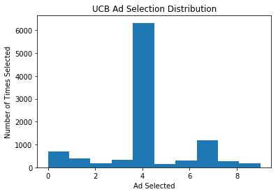
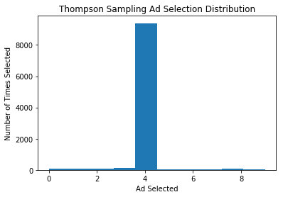

# Reinforcement Learning

## Summary

In previous examples, we examined two types of machine learning models:
  - Supervised Learning, working with labeled data
  - Unsupervised Learning, working with unlabeled data

Next we will explore another type of machine learning, Reinforcement Learning.

In short, reinforcement learning works based on trial and error, where the model is either rewarded or penalized based on the output. The algorithm will try every possible scenario and measure its performance based on maximizing the reward and minimizing the penalty factors.

Reinforcement learning is used to optimize the decision making process in the face of uncertainty. It is widely used to solve the Multi-Armed Bandit Problem. In a Multi-Armed Bandit Problem, you are faced with N decisions where one of the N decisions is the optimal decision but you are uncertain as to which one it is. Using reinforcement learning we can find the optimal decision, N.

The following Reinforcement Learning models will be examined:
  - Upper Confidence Bound (UCB)
  - Thompson Sampling

## Upper Confidence Bound Algorithm

Using the UCB algorithm we will optimize the Click-Through-Rate (CTR) of an internet ad. We are presented with 10 different ads and we want to optimize the CTR by finding which ad has the highest conversion. Normally in a reinforcement learning algorithm there would be no historical data to work with and the model will learn in real-time. For this example we will utilize the [Ads CTR Optimization dataset](./dataset/Ads_CTR_Optimisation.csv) to simulate the reinforcement learning algorithm. There are 10,000 rounds in the dataset and 10 different ads to choose from. At each round the algorithm will add a reward based on the user interaction. In time with enough data the model will find the ad with the highest conversion rate.

There is no scikit-learn packages for implementing reinforcement learning. Instead we will hard code the algorithm using Python.

At each round we need to calculate the upper confidence bound of each ad. The upper confidence bound will change every round depending on the reward awarded by the system and the number of times the ad was selected. In this simulated example there are 10,000 rounds and in each round we need to calculate the confidence interval of all 10 ads. To implement the UCB algorithm we need to initialize the confidence intervals. In other words, we cannot calculate the confidence intervals until all the ads have been selected, or shown, at least once. Since there are 10 different ads to select from, we would initialize the confidence intervals in the first 10 rounds. We would select Ad 1 at round 1, Ad 2 at round 2, Ad 3 at round 3, and so on. At the 11th round, the UCB algorithm will kick in and the model will calculate the confidence intervals of each ad and select the ad with the highest upper confidence bound.

The Python code of the UCB algorithm is shown below.

```Python
# Initializing number of rounds and ads
N = 10000
d = 10

# Initializing List of Ads Selected in each round
ads_selected = []
numbers_of_selections = [0] * d

# Initializing rewards of algorithm
sum_of_rewards = [0] * d
total_reward = 0

# Simulating the 10,000 Rounds as seen in the dataset
for n in range(0,N):
  # Initialize ad with the highest upper confidence bound per round
  ad = 0
  max_upper_bound = 0
  # Loop through each ad and select the ad with the highest upper confidence bound
  for i in range(0,d):
    # Initializing algorithm, each ad must be selected at least once. We will account for this in the first 10 rounds
    if numbers_of_selections[i] > 0:
      # Calculating the average reward based on the number of times the ad was selected and the sum of rewards of the ad up to the current round
      average_reward = sum_of_rewards[i] / numbers_of_selections[i]
      # Calculating the upper confidence bound
      delta_i = math.sqrt((3/2) * math.log(n+1) / numbers_of_selections[i])
      upper_bound = average_reward + delta_i
    else:
      upper_bound = 1e400
    # Selects the ad with the highest upper confidence bound
    if upper_bound > max_upper_bound:
      max_upper_bound = upper_bound
      ad = i
  # List of the ad selected at each round
  ads_selected.append(ad)
  # Number of times each ad was selected
  numbers_of_selections[ad] = numbers_of_selections[ad] + 1
  # Reward based on the simulated dataset, with a reward being awarded when the user clicked on the ad
  reward = dataset.values[n, ad]
  # Sum of rewards of each ad
  sum_of_rewards[ad] = sum_of_rewards[ad] + reward
  # Total reward of the algorithm
  total_reward = total_reward + reward
```

The total reward of our UCB algorithm is 2178 or a CTR of 21.78%. The CTR of the UCB algorithm is almost double the CTR of a random selection algorithm. The figure below shows the distribution of the number of times each ad was selected by our algorithm. We can see that Ad 5 yields the highest rate of conversion with the customer base.



## Thompson Sampling Algorithm

The Multi-Armed Bandit problem can be solved using another type of reinforcement learning algorithm, the Thompson Sampling. Unlike the UCB algorithm, which is deterministic in nature and requires the model to be updated in real-time, the Thompson Sampling algorithm is probabilistic and the model can be updated in batch processes. The Thompson Sampling algorithm provides better empirical evidence compared to the UCB algorithm.

The Thompson Sampling algorithm generates a theoretical beta distribution of each arm based on the data it has accumulated so far on each round. The algorithm then makes a decision based on the highest probability to yield a reward based on these distributions. As new data is processed every round, the distribution curve changes to more accurately depict the empirical truth.

Applying the Thompson Sampling algorithm to our example, we need to consider the cumulative number of times an ad was rewarded and the cumulative number of times it was not rewarded at each round. We then get a random draw for each ad based on the beta distribution of whether or not the ad was rewarded. Next we select an ad based on the highest draw denoting the highest probability of success.

The Python code of the Thompson Sampling algorithm is shown below.

```Python
# Implenting Thompson Sampling
N = 10000
d = 10

# Initializing List of Ads Selected in each round
ads_selected = []

# Initializing rewards of algorithm
numbers_of_rewards_0 = [0] * d
numbers_of_rewards_1 = [0] * d
total_reward = 0

# Simulating the 10,000 Rounds as seen in the dataset
for n in range(0,N):
  # Initialize ad with highest probability of success
  ad = 0
  max_random = 0
  # Loop through each ad and select the ad with the highest probability of success
  for i in range(0,d):
    random_beta = random.betavariate(numbers_of_rewards_1[i] + 1, numbers_of_rewards_0[i] + 1)
    # Selects the ad with the highest upper confidence bound
    if random_beta > max_random:
      max_random = random_beta
      ad = i
  # List of the ad selected at each round
  ads_selected.append(ad)
  # Reward based on the simulated dataset, with a reward being awarded when the user clicked on the ad
  reward = dataset.values[n, ad]
  # Number of times each ad was selected
  if reward == 1:
      numbers_of_rewards_1[ad] = numbers_of_rewards_1[ad] + 1
  else:
      numbers_of_rewards_0[ad] = numbers_of_rewards_0[ad] + 1

  # Total reward of the algorithm
  total_reward = total_reward + reward
```

The total reward of our Thompson Sampling algorithm varies slightly as there is a factor of randomness in the beta distribution. Running the code, the algorithm generated a total reward of 2588 or a CTR of 25.88%. The CTR of the Thompson Sampling algorithm beats both the UCB algorithm and the random selection algorithm. The figure below shows the distribution of the number of times each ad was selected by our algorithm. We can see as we did in the UCB example that Ad 5 yields the highest rate of conversion with the customer base.


